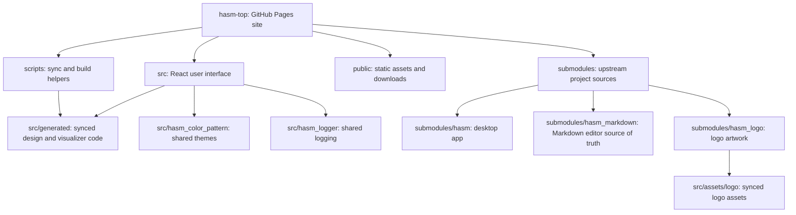

# hasm-top

The top-level site for the HASM project family. It hosts:

- **HASM** (`/` — [src/HASM_Page.jsx](src/HASM_Page.jsx)): the project index page. The HASM desktop app itself is not built yet, so this page is intentionally minimal — brand mark, color theme selector, and a link into the Markdown editor preview.
- **HASM Markdown** ([src/HASM_Markdown_Page.jsx](src/HASM_Markdown_Page.jsx)): a landing page that previews the HASM Markdown editor's look, feel, and syntax highlighting.
- **Extended Commit Graph** ([src/Extended_Commit_Graph.jsx](src/Extended_Commit_Graph.jsx)): a bilingual explanation of the developing HASM visualization method, with generated diagrams for its axes, entities, Git differences, and a worked life-history example.

Pages use hash routes in [src/App.jsx](src/App.jsx), including `/#/extended-commit-graph`. The home ecosystem section links to the Extended Commit Graph page, which shares the persistent language and theme controls.

## GitHub Pages

Visit the published site: [HASM on GitHub Pages](https://hibiyaharaki.github.io/hasm-top/).

## Extended Commit Graph

The Extended Commit Graph page describes EXPERIENCE distribution on the XY plane, time on the Z axis, and the equivalent flattened 2D view. It introduces PERSON, EXPERIENCE, FACT, and LINK notation; explains parent branches and recursive FACT visibility; and uses one complete worked-example graph plus three opacity-focused variants to show non-linear revaluation, structural discontinuity, and restructuring of the subjective layer. In the worked example, EXPERIENCE 0 is Hibiya's life, the parent of EXPERIENCE 1–4.

The diagrams use concise English labels so the generated geometry is shared by both locales; captions, detailed explanations, and alternative text are localized through [src/i18n.js](src/i18n.js).

On wide screens, diagram explanations appear on the left and images on the right; narrow screens stack the text above the image. Click or tap any diagram to open a full-window YARL viewer with zoom and pan support (Escape or the close button returns to the page). EXPERIENCE headings expand and collapse their FACT details, and LINK headings expand and collapse their relationship descriptions. Both start collapsed.

Regenerate all current diagrams with the shared HASM palette:

```powershell
npm run generate:ecg-diagrams
```

The generator is dependency-free and writes the explanatory PNG files into [public/images](public/images). This page does not modify submodule sources.

## Philosophy

HASM explores tools that keep personal expression and structured knowledge in conversation. Its projects favor thoughtful, portable software: tools that can be carried between contexts, remain close to their data, and help people turn ideas into forms they can revisit and share.

HASM Markdown is one practical expression of that idea. It treats writing as both a private act of thinking and a durable, readable structure for communication.

## Repository Structure



## Submodules

| Path | Purpose |
| --- | --- |
| `submodules/hasm` | The HASM desktop app source. |
| `submodules/hasm_markdown` | The HASM Markdown editor source — **source of truth** for the editor/preview design and syntax highlighting used on the Markdown page here. |
| `submodules/hasm_logo` | Generated HASM logo/favicon artwork. |
| `src/hasm_logger` | Shared logging helpers. |
| `src/hasm_color_pattern` | Shared color pattern (theme) definitions, used for the theme selector on both pages. |

Clone with submodules:

```bash
git clone --recurse-submodules <repo-url>
# or, if already cloned:
git submodule update --init --recursive
```

## Design sync system

This app never edits `hasm_markdown` or `hasm_logo` directly. Instead, two scripts read those submodules and regenerate local files, so any change made upstream is picked up automatically:

- `scripts/sync-logo.mjs` — copies the HASM logo variants from `submodules/hasm_logo/logo/hasm` into `src/assets/logo/` and `public/favicon.png`.
- `scripts/sync-markdown-design.mjs` — parses `submodules/hasm_markdown/src/main.css` and `HASM_Markdown_Editor.jsx` to regenerate:
  - `src/generated/markdown-design-tokens.css` — the editor/preview color tokens and `MarkdownSyntax_*` / `HASM_Markdown_Editor_*` CSS rules.
  - `src/generated/markdownHighlight.js` — the exact `highlightMarkdown()` syntax-highlighting function.

Both scripts run automatically before `npm run dev` / `npm run build` (via `predev` / `prebuild`). If a submodule isn't checked out, the corresponding script warns and skips instead of failing the build. You can also run them manually:

```bash
npm run sync            # logo + markdown design
npm run sync:logo
npm run sync:markdown-design
```

Files under `src/generated/` are auto-generated — do not edit them by hand.

## Color theme selection

`src/hasm_color_pattern` exports the shared HASM color patterns (`COLOR_PATTERN_OPTIONS`, `getThemeVariables`, `getMarkdownThemeVariables`, etc.). [src/theme/useColorTheme.js](src/theme/useColorTheme.js) is a small hook that:

- restores the previously selected pattern from `localStorage` (`hasm_theme_preference`),
- applies the pattern's CSS custom properties to `document.documentElement`,
- derives readable accent/on-accent tokens for contrast-safe UI chrome (gutter text, badges).

[src/ThemeSelector.jsx](src/ThemeSelector.jsx) renders the dropdown UI and is used on both `HASM_Page` and `HASM_Markdown_Page`, so the selected theme is shared across the whole site.

## Development

```bash
npm install
npm run dev      # start Vite dev server (runs the sync scripts first)
npm run build    # production build (runs the sync scripts first)
npm run lint     # oxlint
npm run preview  # preview a production build
```

## GitHub Pages deployment

Pushes to `main` run [.github/workflows/deploy-pages.yml](.github/workflows/deploy-pages.yml), which checks out this repo with all submodules, builds the site, and publishes `dist/` to GitHub Pages. The site is served from `https://<owner>.github.io/hasm-top/`, so the production build sets `GITHUB_PAGES=true` to make Vite emit asset URLs prefixed with `/hasm-top/` (see [vite.config.js](vite.config.js)). Local `npm run dev` / `npm run build` are unaffected and stay rooted at `/`.

In the repository settings, set **Settings → Pages → Source** to **GitHub Actions** so this workflow can deploy.
